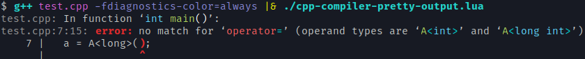
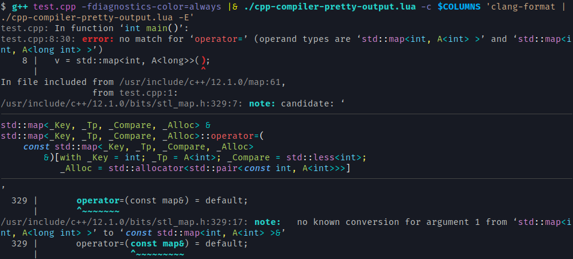

Highlight output parts of C++ compilers (gcc, clang and msvc).

```shell-console
$ g++ test.cpp -fdiagnostics-color=always |& cpp-compiler-pretty-output.lua
```



An external command like `clang-format` can be configured to format very large expressions.

```shell-console
$ g++ test.cpp -fdiagnostics-color=always |& ./cpp-compiler-pretty-output.lua -c $COLUMNS 'clang-format | ./cpp-compiler-pretty-output.lua -E'
```



More options with `-h`/`--help` parameter.


## Installation

```bash
luarocks install --local https://raw.githubusercontent.com/jonathanpoelen/cpp-compiler-pretty-output/master/cpp-compiler-pretty-output-1.1-1.rockspec

# or in your local directory

luarocks make --local cpp-compiler-pretty-output-1.1-1.rockspec
```
