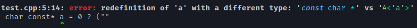

Highlight output parts of C++ compilers.

> clang++ test.cpp -fdiagnostics-color=always |& cpp-compiler-pretty-output.lua



An external command like `clang-format` can be configured to format very large expressions.

## Installation

```bash
luarocks install --local https://raw.githubusercontent.com/jonathanpoelen/cpp-compiler-pretty-output/master/cpp-compiler-pretty-output-1.0-0.rockspec

# or in your local directory

luarocks make --local cpp-compiler-pretty-output-1.0-0.rockspec
```
